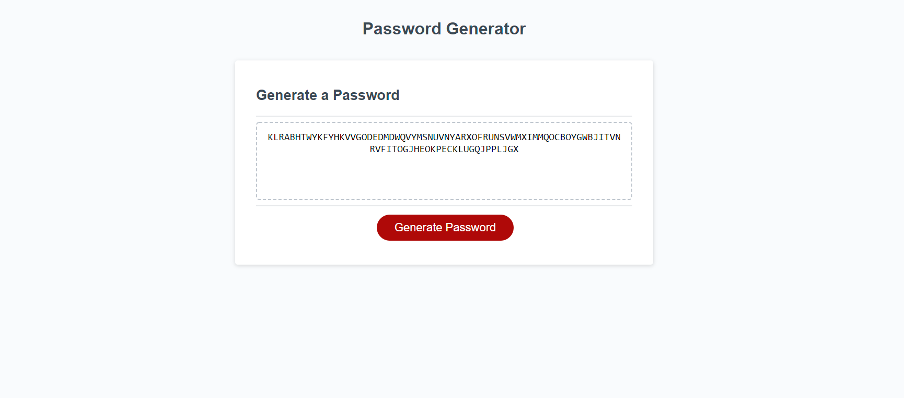
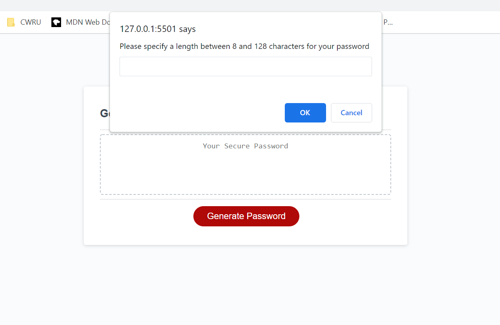
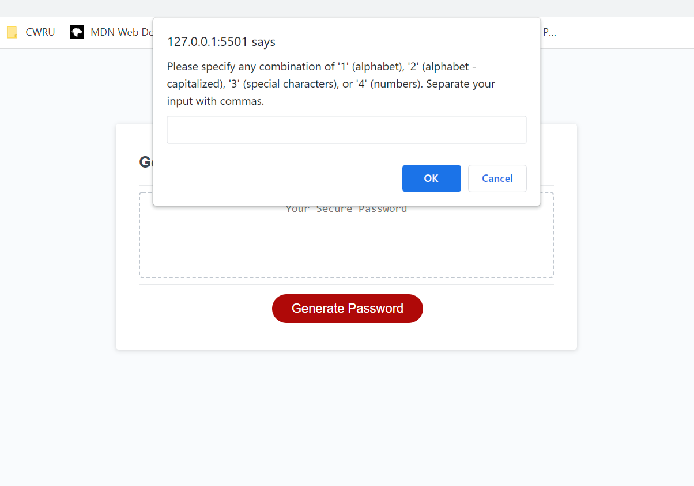
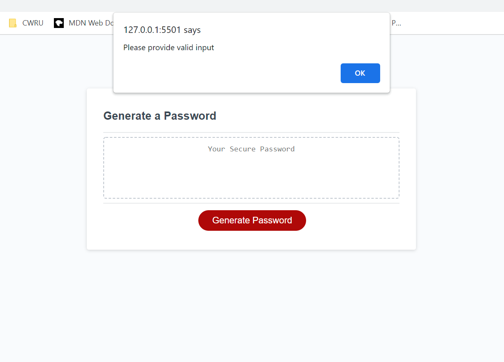

# Random Password Generator

## The Repository

This repository contains the HTML, CSS and Javascript code for the Random Password Generator Project.

## Random Password Generator

In this day and age, securing your accounts with strong, randomized passwords is essential to maintaining peace of mind. With the Random Password Generator, users can create fully customized and completely random passwords that will secure their information from cyber criminals.

## Usage

The Random Password Generator was designed with simplicity of use in mind. By pressing the 'generate password' button, the user will be presented with a series of prompts that allows them to customize their password.

The first prompt allows the user to specify the length of the password. All lengths between 8 characters and 128 characters are valid.

The next prompt allows the user to specify the actual content of the password. The user can specify 1 and 2 to include lowercase and uppercase alphabetical characters, respectively, 3 for special characters and 4 for numbers. Users can include any combination of these options.

If invalid input is provided, the user will be presented with the following prompt and must reenter their input.

## Deployed Application

the deployed application can be found by following the link below.

https://rrich-kray.github.io/password-generator/

## Feedback

Leave comments/suggestions in the Slack channel!

## License

Copyright &copy; Random Password Generator, Inc. All rights reserved.

